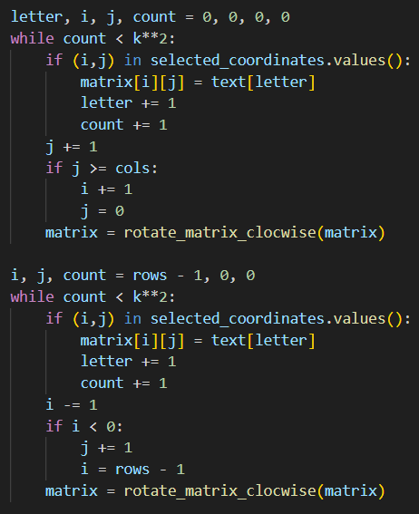
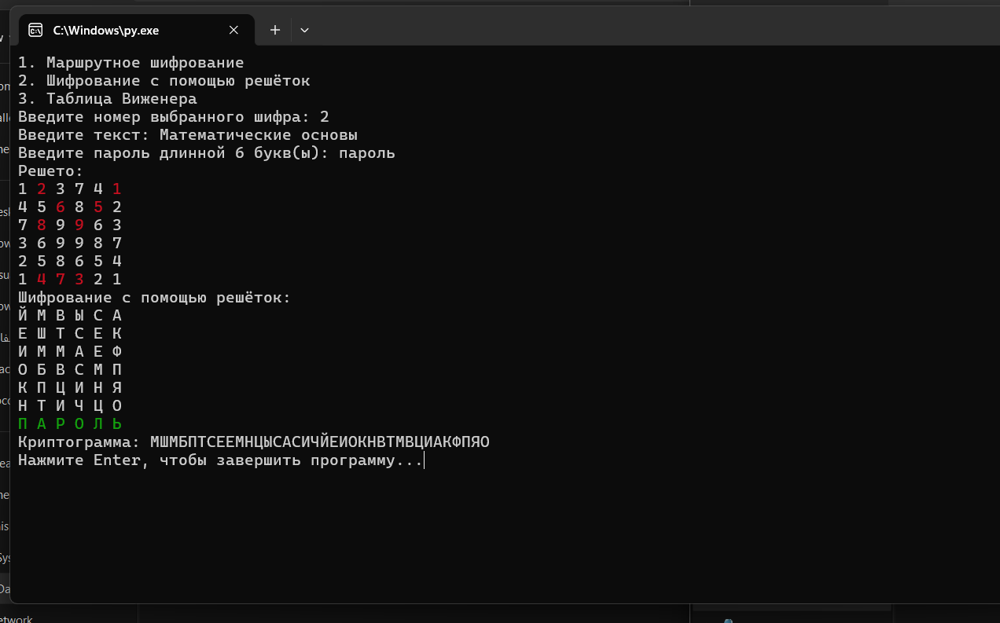
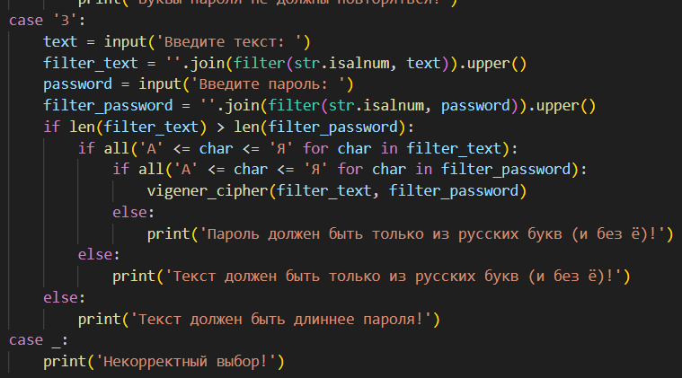
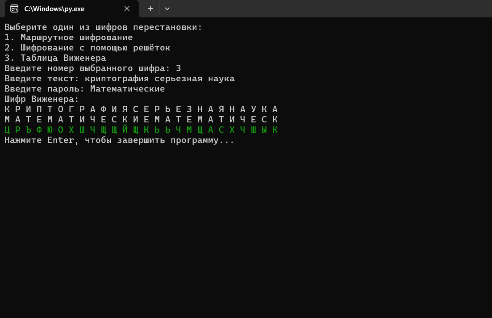

---
# Front matter
lang: ru-RU
title: "Лабораторная работа №2"
subtitle: "Дисциплина: Математические основы защиты информации и информационной безопасности"
author: "Мохаммад хоссейн фарзанфар"

# Formatting
toc-title: "Содержание"
toc: true # Table of contents
toc_depth: 2
lof: true # Список рисунков
lot: true # Список таблиц
fontsize: 12pt
linestretch: 1.5
papersize: a4paper
documentclass: scrreprt
polyglossia-lang: russian
polyglossia-otherlangs: english
mainfont: PT Serif
romanfont: PT Serif
sansfont: PT Sans
monofont: PT Mono
mainfontoptions: Ligatures=TeX
romanfontoptions: Ligatures=TeX
sansfontoptions: Ligatures=TeX,Scale=MatchLowercase
monofontoptions: Scale=MatchLowercase
indent: true
pdf-engine: lualatex
header-includes:
  - \linepenalty=10 # the penalty added to the badness of each line within a paragraph (no associated penalty node) Increasing the value makes tex try to have fewer lines in the paragraph.
  - \interlinepenalty=0 # value of the penalty (node) added after each line of a paragraph.
  - \hyphenpenalty=50 # the penalty for line breaking at an automatically inserted hyphen
  - \exhyphenpenalty=50 # the penalty for line breaking at an explicit hyphen
  - \binoppenalty=700 # the penalty for breaking a line at a binary operator
  - \relpenalty=500 # the penalty for breaking a line at a relation
  - \clubpenalty=150 # extra penalty for breaking after first line of a paragraph
  - \widowpenalty=150 # extra penalty for breaking before last line of a paragraph
  - \displaywidowpenalty=50 # extra penalty for breaking before last line before a display math
  - \brokenpenalty=100 # extra penalty for page breaking after a hyphenated line
  - \predisplaypenalty=10000 # penalty for breaking before a display
  - \postdisplaypenalty=0 # penalty for breaking after a display
  - \floatingpenalty = 20000 # penalty for splitting an insertion (can only be split footnote in standard LaTeX)
  - \raggedbottom # or \flushbottom
  - \usepackage{float} # keep figures where there are in the text
  - \floatplacement{figure}{H} # keep figures where there are in the text
---

# Цель работы

Познакомиться с шифрами перестановки.

# Задание

1. Программно реализовать маршрутное шифрование.
2. Программно реализовать шифрование с помощью решёток.
3. Программно реализовать шифр Виженера.

# Выполнение лабораторной работы

1) Все шифрования я реализовывал на языке python. Сначала я реализовал возможность выбора одного из трёх шифров пользователем. Далее при помощи match-case я реализовал выполнение конкретных шифрований. Реализацию я начал с маршрутного шифрования. Я сделал запрос текста и пароля у пользователя, их фильтрацию на наличие пробелов, цифр или знаков пунктуации, а также возвёл всё в верхний регистр. Также я добавил проверки текста и пароля на соответствие требованиям для шифрования.

{ width=70% }

Я реализовал русский алфавит для удобного заполнения массивов. Далее я реализовал функцию route_cipher, в которой создал матрицу размером с текст пользователя и шириной с его пароль. Я заполнил её побуквенно текстом пользователя, а пустые места заполнил случайными русскими буквами.

{ width=70% }

После я реализовал общую для первого и второго шифрования функцию cryptogram, которая из заданного массива и введённого пользователем пароля создаёт таблицу, которую выводит, а затем создаётся криптограмму. Данная функция сначала добавляет к одному массиву 2 строчки (с паролем и ASCII номерами букв этого пароля). Далее она берёт последнюю строчку матрицы, сортирует по возрастанию, а затем формирует новую матрицу из старой, учитывая отсортированную последнюю строку. Этот функционал схож как для маршрутного шифрования, так и для шифрования с помощью решёток.

{ width=70% }

Далее я запустил два теста через командную строку. Один тест как в теории к лабораторной работе №2. Второй тест для дополнительной проверки. Шифрование совпало с тестом в лабораторной работе №2, и реализовано верно.

{ width=70% }

2) Затем я перешёл к реализации шифрования с помощью решёток. Я аналогично предыдущему шифрованию запросил текст у пользователя, но в данном случае я запрашиваю пароль необходимой длины 2k, как сказано в теории к лабораторной работы. При этом длина текста N должна быть равна k**2. Также я аналогично проверяю текст и пароль на соответствие требованиям для шифрования.

{ width=70% }

Далее я реализовал функцию lattice_cipher, в которой я создал матрицу размера 2k и заполнил её нулями. Далее я заполнял каждую четверть значениями от 1 до k**2 в соответствии с инструкцией учебника. Далее я определил случайным образом по одному уникальному значению из получившейся матрицы и записал их индексы. Далее я вывел данную матрицу, закрашивая выбранные значения красным цветом.

{ width=70% }

Для того чтобы заполнить матрицу значениями от 1 до k**2, я реализовал функцию вращения матрицы на 90 градусов по часовой стрелке. 

{ width=70% }

Далее для правильного заполнения матрицы текстом пользователя, я реализовал 4 похожих, но разных цикла. Сначала я заполнял все уникальные значения побуквенно текстом пользователя. Затем я поворачивал матрицу на 90 градусов по часовой стрелке, и менял направление заполнения матрицы в соответствии с описанием в лабораторной работе №2. И обязательно в конце использовал ранее реализованную функцию формирования криптограммы.

{ width=70% }

{ width=70% }

Далее я запустил два теста через командную строку. Один тест как в теории к лабораторной работе №2. Второй тест для дополнительной проверки. Шифрование совпало с тестом в лабораторной работе №2, и реализовано верно.

{ width=70% }

{ width=70% }

3) И в конце я перешёл к реализации шифра Виженера. В первую очередь для его реализации нам потребуется таблица с русским алфавитом, где каждая следующая строка сдвигается на одну букву. Данную таблицу я реализовал в виде матрицы, использую ранее составленную матрицу с русским алфавитом.

{ width=70% }

Затем я перешёл к реализации шифра Виженера. Я аналогично предыдущим шифрованиям запросил текст и пароль у пользователя, отфильтровал их, а также проверил на соответствие требованиям для шифрования. Так как для шифрования используется таблица с русским алфавитом, то и текст и пароль должны содержать только русские буквы.

{ width=70% }

Далее я реализовал функцию vigener_cipher, в которой создаётся матрица, где первая строка - текст пользователя, вторая строка - повторяющийся пароль пользователя, а третья строка пуста (для будущей криптограммы). Далее я брал первую букву первой строки (текста пользователя), находил её в первой строке таблицы с русским алфавитом и записывал index j. Затем я брал первую букву второй строки (повторяющийся пароль), находил её в первом столбце таблицы с русским алфавитом и записывал index i. И наконец я находил в таблице с русским алфавитом букву с индексами (i, j), и записывал её в первый слот третьей строки (будущей криптограммы). Так для каждой буквы текста пользователя.

{ width=70% }

Далее я запустил два теста через командную строку. Один тест как в теории к лабораторной работе №2. Второй тест для дополнительной проверки. Шифрование совпало с тестом в лабораторной работе №2, и реализовано верно.

{ width=70% }

# Выводы

Я программно реализовал шифры перестановки.
